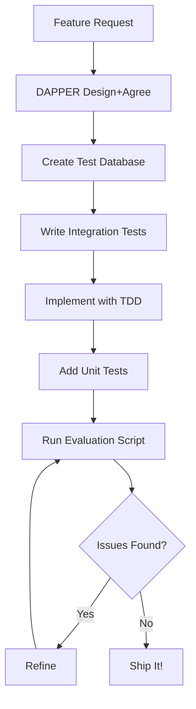

# Process Improvements - Lessons from Event Manager Implementation

## Date: August 8, 2025
## Feature: Event Manager DAPPER Cycle Analysis

## 1. 🔴 Critical Improvements Needed

### Testing Strategy Should Be "Integration-First"
**Problem**: We wrote 841 unit tests with heavy mocking, only to discover they gave false confidence. Real bugs (Todo field mismatches) weren't caught.

**Solution**: 
```yaml
Testing Pyramid Reform:
  1. Integration Tests FIRST (60%) - Real database, real constraints
  2. Unit Tests SECOND (30%) - Only for pure business logic
  3. E2E Tests THIRD (10%) - Critical user paths
```

**Action Items**:
- [ ] Update CLAUDE.md with "integration-first" testing policy
- [ ] Create test database setup as part of Phase 1 for all features
- [ ] Require integration tests in PR checklist

### Earlier Schema Validation
**Problem**: Schema mismatches (createdBy vs creatorId, notes vs metadata) weren't caught until Phase 4 runtime.

**Solution**:
```typescript
// Add to Phase 1 checklist:
- [ ] Run TypeScript compilation after schema changes
- [ ] Test all Prisma operations with real queries
- [ ] Validate field names match across all layers
```

### Proactive Integration Testing During Development
**Problem**: Built everything with mocks, then had to retrofit integration tests in REFINE.

**Solution**:
```bash
# New development workflow
1. Create feature branch
2. Set up test database immediately
3. Write integration test BEFORE implementation
4. Implement with real database testing
5. Add unit tests only for complex logic
```

## 2. 🟡 Process Optimizations

### DAPPER Improvements

#### Combine Design + Agree for Smaller Features
```yaml
Current: Design → Agree → Plan → Produce → Evaluate → Refine
Better:  Design+Agree → Plan → Produce → Evaluate → Refine
```
For features under 3 phases, combine Design and Agree to reduce overhead.

#### Add "Pre-flight Check" Before Produce
```yaml
Plan → [Pre-flight] → Produce
       ↓
     - Schema compilation check
     - Integration test setup ready
     - API contract validation
     - Dependency verification
```

#### Automated Evaluation
Create standard evaluation script for all features:
```javascript
// evaluate-feature.js template
- API availability tests
- Authentication tests  
- Performance benchmarks
- Integration verification
- Overmocking detection
```

### Migration Safety Improvements

**Current Issue**: Fear of `prisma db push` destroying data

**Improvement**: Automated safety wrapper
```bash
#!/bin/bash
# safe-migrate.sh
1. Check environment (block if production)
2. Automatic backup before migration
3. Dry run with diff display
4. Confirmation prompt
5. Apply migration
6. Verify with health check
```

### Documentation Templates

Create standard templates to ensure consistency:
```
docs/templates/
├── DESIGN-TEMPLATE.md          # For Design phase
├── PLAN-TEMPLATE.md            # For Plan phase
├── EVALUATION-TEMPLATE.md      # For Evaluate phase
├── INTEGRATION-TEST-TEMPLATE.ts # For test structure
└── API-DOCS-TEMPLATE.md        # For endpoint documentation
```

## 3. 🟢 Things That Worked Well (Keep Doing)

### TodoWrite Tool Usage
- Excellent for tracking multi-phase work
- Keep using for all DAPPER phases
- Add automatic todo creation from plan documents

### Phase-Based Development
- Clear deliverables per phase
- No time estimates (avoided pressure)
- Independent, testable chunks

### Code Review Integration
- `mcp__zen__codereview` caught issues early
- Continue using after each phase

### Real API Testing
- The evaluation script with actual HTTP calls was valuable
- Extend to all features

## 4. 📋 Recommended Process Changes

### Update CLAUDE.md with New Policies

```markdown
## Testing Requirements (UPDATED)

### Integration-First Testing
1. Set up test database in Phase 1
2. Write integration tests BEFORE implementation
3. Mock only external services (email, payments)
4. Minimum 70% integration test coverage for services
5. Unit tests only for pure business logic

### Schema Validation
1. Run `npm run build` after EVERY schema change
2. Test Prisma operations immediately after model creation
3. No Phase complete without TypeScript compilation passing

### Migration Safety
1. NEVER use `prisma db push` 
2. ALWAYS use `npm run db:migrate:new`
3. MANDATORY backup before production migrations
4. Test migrations on test database first
```

### New NPM Scripts

```json
{
  "scripts": {
    "test:integration:create": "node scripts/create-integration-test.js",
    "db:test:setup": "DATABASE_URL=$TEST_DATABASE_URL prisma migrate reset",
    "db:test:seed": "DATABASE_URL=$TEST_DATABASE_URL tsx prisma/seed.ts",
    "validate:schema": "tsc --noEmit && prisma validate",
    "precommit": "npm run validate:schema && npm run test:integration"
  }
}
```

### CI/CD Pipeline Additions

```yaml
# .github/workflows/test.yml additions
- name: Setup Test Database
  run: |
    createdb maix_test
    npm run db:test:setup
    
- name: Integration Tests
  run: npm run test:integration
  
- name: Overmocking Check
  run: |
    MOCK_COUNT=$(grep -r "jest.mock" src --include="*.test.ts" | wc -l)
    if [ $MOCK_COUNT -gt 50 ]; then
      echo "Warning: High mock count ($MOCK_COUNT). Consider integration tests."
      exit 1
    fi
```

## 5. 🎯 Specific Action Items

### Immediate (This Week)
1. [ ] Create `test-database-setup.md` guide
2. [ ] Add integration test requirement to PR template
3. [ ] Create feature evaluation script template
4. [ ] Update CLAUDE.md with testing policy

### Short-term (This Month)
1. [ ] Retrofit integration tests for existing features
2. [ ] Create automated overmocking detection
3. [ ] Build test data factory utilities
4. [ ] Add performance benchmarking to CI

### Long-term (This Quarter)
1. [ ] Achieve 80% integration test coverage
2. [ ] Implement automated DAPPER tracking
3. [ ] Create feature flag system for progressive rollout
4. [ ] Build test environment provisioning

## 6. 🚀 New Development Workflow



## 7. 📊 Success Metrics

Track these metrics for process improvement:

| Metric | Current | Target | Measurement |
|--------|---------|--------|-------------|
| Bugs caught by tests | 60% | 95% | Post-release defects |
| Integration test coverage | 10% | 70% | Service layer coverage |
| Mock usage | 145/test | <10/test | Average mocks per test file |
| Schema mismatch bugs | 3/feature | 0/feature | TypeScript compilation |
| Migration failures | 1/month | 0/quarter | Production incidents |
| DAPPER cycle time | 2 days | 1 day | Design to Refine |

## 8. 🎓 Lessons Learned Summary

### What Hurt Us
- Overmocking hid real bugs
- Schema mismatches weren't caught early
- Fear of database operations led to mock overuse

### What Helped Us
- DAPPER structure provided clarity
- Phase-based approach reduced complexity
- TodoWrite kept us organized
- Real API testing caught issues

### What We'll Change
- Integration tests FIRST, not last
- Test database from Day 1
- Validate schemas continuously
- Automate evaluation checks

## Conclusion

The Event Manager taught us valuable lessons. By implementing these process improvements, we can:
- Ship with higher confidence
- Catch bugs earlier
- Reduce REFINE phase work
- Improve development velocity

**Next Step**: Update CLAUDE.md and create integration test template for the next feature.

---

*"The best time to write an integration test was at the start of the project. The second best time is now."*